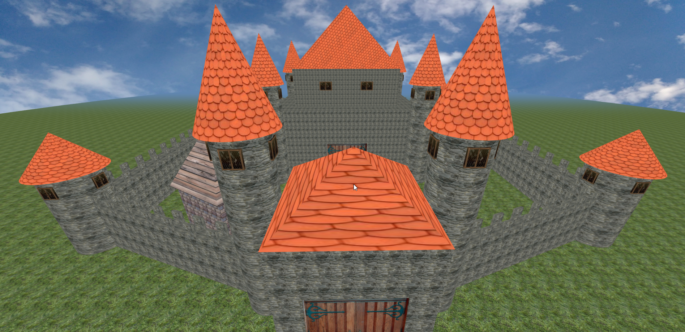

# Chateau-ThreeJS

Lien: https://github.com/Nouuu/Chateau-ThreeJS

Premier projet avec la librairie ThreeJS, ce projet scolaire nous demandait de réaliser un château fort, sans plus d'informations.

**Table des matières :**

<!-- toc -->

- [Description](#description)
- [Code](#code)
- [Visuels](#visuels)
- [Auteurs](#auteurs)

<!-- tocstop -->

# Description

Nous avons décidé de nous familiariser à la librairie ThreeJS à l'aide de ce projet. L'idée était de faire le plus de fonctions possibles et de faire en sorte que le château puisse être généré en fonction d'un taille donnée. Le plus complexe a été de faire des murailles avec des tailles pouvant varier, et les placer correctement pour former un sorte de pentagone.

# Code

Nous avons donc créé des objets au début de notre script contenant les différentes tailles de nos objets :

```jsx
...
var FrontMuraille = {
	Width: 150,
	Height: 40,
	Depth: 10,
        };
var Muraille = {
	Width: FrontMuraille.Width * 2 + Gate.Width,
	Height: 40,
	Depth: 20,
};
var Rempart = {
	Width: 8,
	Height: 10,
	Depth: 2,
};
...
```

La fonction de création de cette muraille était alors appelé avec ces objets, ainsi que le chemin de la texture utilisé :

```jsx
function createMuraille(Muraille, Rempart = null, textPath) {
        var geometry;
        var textMur = new THREE.TextureLoader().load(textPath);
        if (Rempart !== null) {
            var textRempart = new THREE.TextureLoader().load(textPath);
            textRempart.wrapS = THREE.RepeatWrapping;
            textRempart.wrapT = THREE.RepeatWrapping;
            textRempart.repeat.set(Rempart.Width / 20, Rempart.Height / 20);
            var materialRempart = new THREE.MeshBasicMaterial({map: textRempart});
        }
        textMur.wrapS = THREE.RepeatWrapping;
        textMur.wrapT = THREE.RepeatWrapping;
        textMur.repeat.set(Muraille.Width / 20, Muraille.Height / 20);
        var materialMur = new THREE.MeshBasicMaterial({map: textMur});

        var group = new THREE.Group();

        geometry = new THREE.CubeGeometry(Muraille.Width, Muraille.Height, Muraille.Depth);
        mesh = new THREE.Mesh(geometry, materialMur);
        mesh.position.y = Muraille.Height / 2;
        group.add(mesh.clone());

        if (Rempart !== null) {
            for (let initX = -(Muraille.Width / 2) + (Rempart.Width / 2); initX <= Muraille.Width / 2; initX += 20) {
                geometry = new THREE.CubeGeometry(Rempart.Width, Rempart.Height, Rempart.Depth);
                mesh = new THREE.Mesh(geometry, materialRempart);
                mesh.position.set(initX, Muraille.Height + Rempart.Height / 2, (Muraille.Depth - Rempart.Depth) / 2);
                group.add(mesh.clone());
                mesh.position.z = (-Muraille.Depth + Rempart.Depth) / 2;
                group.add(mesh.clone());
            }
        }
        return group;
    }
```

Il ne nous restait alors plus qu'à le positionner correctement en fonction des précédents objets, l'instancier dans la scène (ce qui le clonait, afin de pouvoir réutiliser le même objet par la suite) et continuer ainsi de suite :

```jsx
...
frontMuraille.rotateY(Math.radians(20));
frontMuraille.position.set(tourEntree.position.x + TourEntree.Radius + FrontMuraille.Width / 2 - 10, 0, tourEntree.position.z - 30);
instanceToScene(frontMuraille);
tour.position.set(frontMuraille.position.x + FrontMuraille.Width / 2 + Tour.Radius - 10, 0, frontMuraille.position.z - Tour.Radius - 10);
instanceToScene(tour);
muraille.rotateY(Math.radians(90));
muraille.position.set(tour.position.x, 0, tour.position.z - Tour.Radius - Muraille.Width / 2 + 10);
instanceToScene(muraille);
...
```

# Visuels

Le site est accessible ici : [https://nouuu.github.io/Chateau-ThreeJS/](https://nouuu.github.io/Chateau-ThreeJS/)

Oui c'est carré 😅 !!

|          |  |
| --------------------------------------------------- | --------------------------------------------------- |
|  |  |

# Auteurs

Ce projet a été mené par moi ainsi que 3 autres personnes :

|                                                      |                                                             |
| :--------------------------------------------------- | :---------------------------------------------------------: |
| [Baptiste DEMARCHE](https://github.com/batmine3)     |        |
| [Joëlle CASTELLI](https://github.com/JoelleCastelli) |  |
| [Swann HERRERA](https://github.com/SwannHERRERA)     |    |
| [Noé LARRIEU-LACOSTE](https://github.com/Nouuu)      |           |
